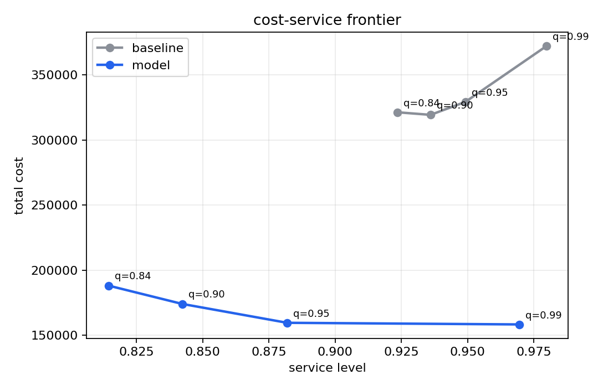

# Industrial Decision Intelligence Lab

[](https://github.com/SihyeonJeon/industrial-decision-intelligence-lab/actions/workflows/ci.yml)
[](LICENSE)

Forecast-to-inventory simulation on retail transaction data

Forecast error is not the result. The useful question is whether a forecast
changes an inventory policy without breaking the service floor. This repo runs
that full path: demand aggregation, short-horizon forecasting, base-stock
policy selection, cost/service simulation, sensitivity checks, and SKU-level
diagnostics.



## What It Does

- builds daily SKU demand from transaction data
- compares a seasonal baseline against a model-informed forecast
- chooses base-stock levels under lead-time and service constraints
- simulates holding cost, stockout cost, service level, and order volume
- tests cost/service sensitivity across 36 scenarios
- tests lead-time uncertainty across 16 scenarios
- writes JSON, CSV, and figure outputs for review

## Current Result

UCI Online Retail II, top 12 SKUs, final 60-day simulation

| Check | Result |
| --- | ---: |
| model WAPE | 0.861 |
| seasonal baseline WAPE | 1.071 |
| model policy cost | 77,323.91 |
| baseline policy cost | 174,450.85 |
| service level | 0.928 |
| service floor | 0.900 |
| frontier cost delta | 53.4% lower |
| sensitivity pass count | 9 / 36 |
| lead-time pass count | 4 / 16 |
| SKU service floor pass | 11 / 12 |

The selected model policy passes the current service floor and lowers simulated
cost on the dataset split. The robustness checks also expose the weak region:
lower service quantiles save inventory but miss the service floor, and one SKU
still carries service risk.

Visual case page:
<https://sihyeonjeon.github.io/projects/industrial-decision-intelligence-lab/>

## Quick Start

```bash
git clone https://github.com/SihyeonJeon/industrial-decision-intelligence-lab
cd industrial-decision-intelligence-lab
uv sync
uv run decision-lab run --synthetic --report-dir /tmp/decision-lab-smoke
```

Run on the default public dataset:

```bash
uv run decision-lab fetch
uv run decision-lab run --top-skus 12
```

The raw Excel file is not committed. `decision-lab fetch` downloads Online
Retail II from UCI into `data/raw/`; see [data/README.md](data/README.md).

## Outputs

```text
reports/
  decision_report.json
  sku_metrics.csv
  service_frontier.csv
  sensitivity_grid.csv
  lead_time_grid.csv
  figures/
    policy_comparison.png
    service_frontier.png
    sensitivity_grid.png
    lead_time_grid.png
    sku_tradeoffs.png
```

Useful files:

- [decision_report.json](reports/decision_report.json): summary metrics and
  decision gate
- [sku_metrics.csv](reports/sku_metrics.csv): SKU-level forecast and service
  diagnostics
- [service_frontier.csv](reports/service_frontier.csv): feasible policy grid
- [lead_time_grid.csv](reports/lead_time_grid.csv): lead-time robustness grid

## Test

```bash
uv run ruff check src tests
uv run pytest
```

CI also runs a synthetic smoke pipeline.

## Boundary

Dataset simulation only. Not production inventory advice, not a public
benchmark, and not a claim that the same policy transfers to another retailer
without local demand, lead-time, cost, and service calibration.
