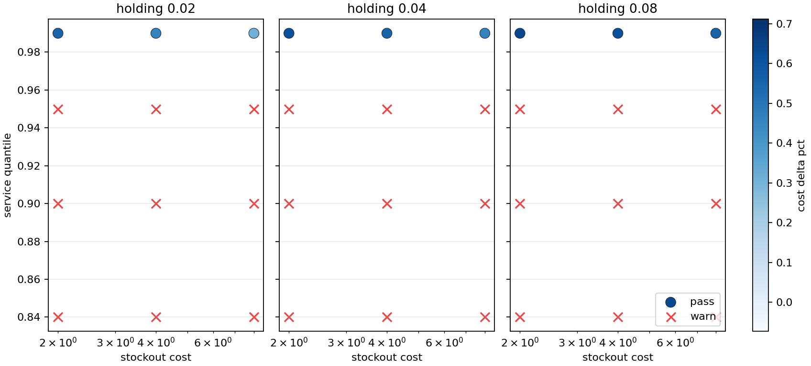

# Industrial Decision Intelligence Lab

Retail transaction data to inventory policy simulation:

- aggregate SKU demand
- forecast short-horizon demand
- choose base-stock levels under lead time and service target
- simulate cost, stockouts, and service level
- compare a seasonal baseline against a model-informed policy

## Data

Default source: UCI Online Retail II.

The raw Excel file is not committed. Download it locally, then run the pipeline.

## Run

```bash
uv sync
uv run decision-lab fetch
uv run decision-lab run --top-skus 12
```

Outputs:

- `reports/decision_report.json`
- `reports/sku_metrics.csv`
- `reports/service_frontier.csv`
- `reports/sensitivity_grid.csv`
- `reports/lead_time_grid.csv`
- `reports/figures/policy_comparison.png`
- `reports/figures/service_frontier.png`
- `reports/figures/sensitivity_grid.png`
- `reports/figures/lead_time_grid.png`
- `reports/figures/sku_tradeoffs.png`

## Result View



## Current Result

UCI Online Retail II, top 12 SKUs, final 60-day simulation:

- model WAPE: `0.861` vs seasonal baseline `1.071`
- model policy cost: `77,323.91` vs baseline `174,450.85`
- service level: `0.928` vs baseline `0.957`
- service floor: `0.900`
- decision gate: `pass`
- sensitivity: `9 / 36` tested cost-service scenarios pass
- lead-time uncertainty: `4 / 16` scenarios pass
- frontier selection: baseline q=`0.95`, model q=`0.99`
- SKU diagnostics: `11 / 12` model policies meet the service floor

q=`0.99` is the reliable region in the current grid. Lower service settings
save inventory but miss the service floor. Under lead-time values from 5 to 14
days, q=`0.99` is the only tested model setting that keeps the service floor in
every lead-time scenario.

Dataset simulation only. Not production inventory advice.
